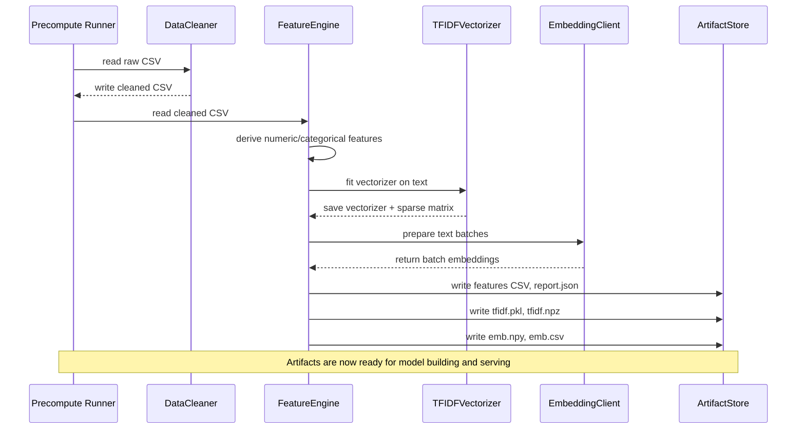
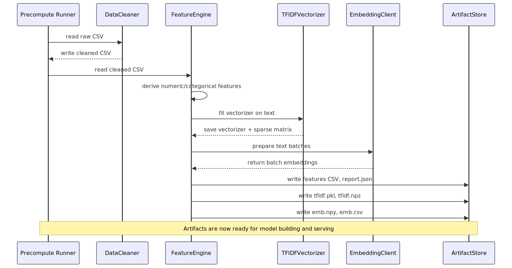
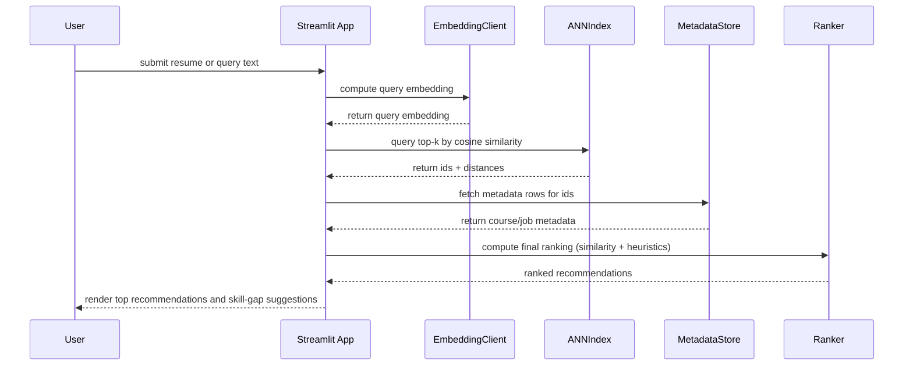
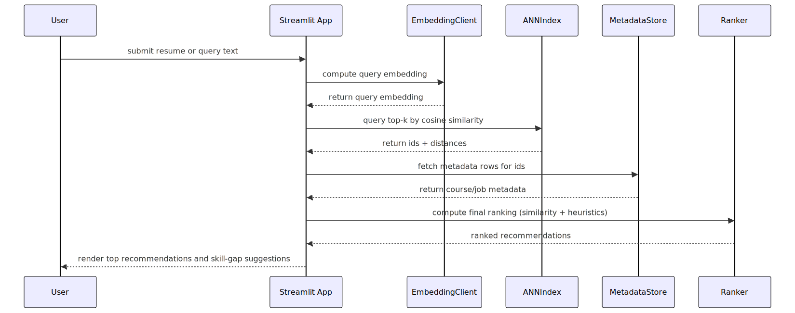
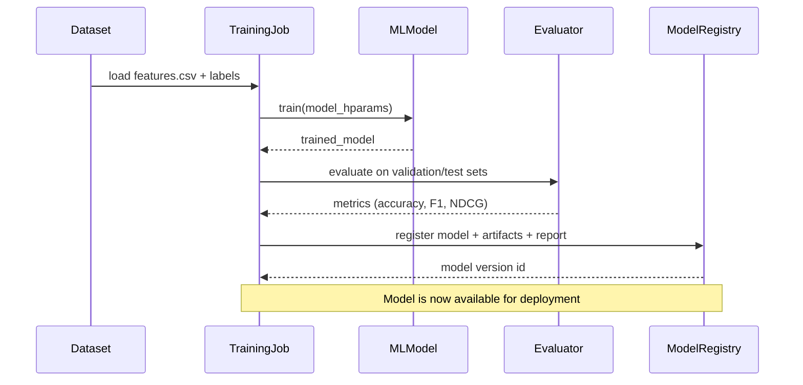
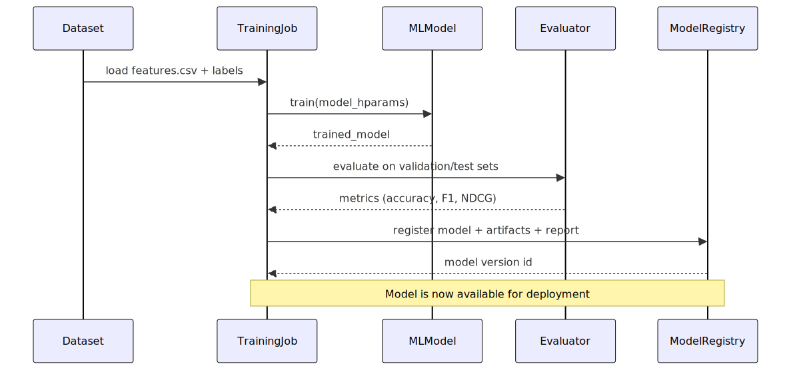

# NextHorizon — Machine Learning Pipeline Overview

This document describes the end-to-end machine learning pipeline in the NextHorizon project. It explains how data is collected, cleaned, preprocessed, how features and embeddings are generated, how models are trained and evaluated, how predictions and recommendations are served, and how diagnostics and observability are implemented.

Where relevant, file paths in the repository are referenced so engineers can find the implementation.

---

## Table of Contents
- Overview
- Data Collection
- Data Cleaning & Validation
- Preprocessing & Feature Engineering
- Text Enrichment, Readability, and NLP Features
- TF-IDF and Vectorization
- Embeddings: what they are and how we compute them
- Vector stores and nearest-neighbor search
- Train / Test datasets and experiment management
- Prediction & Recommendation Algorithms
- Evaluation, Metrics, and Validation
- Serving, UI Integration, and Diagnostics
- Sequence Diagrams
- Next Steps and Operational Considerations

---

**Note:** Where code is present in the repository, this document references the existing implementations:
- Cleaning: `utils/data_enhancer.py`, `utils/data_cleaner.py`
- Feature engineering: `utils/feature_engineering.py`
- Embedding compute: `scripts/precompute_embeddings.py`, `ai/openai_client.py`
- Diagnostics UI: `ui/diagnostics.py`, `app.py`
- Precompute runner scripts: `scripts/precompute_features.py`

For direct code references, see these key functions in the repository:
- `utils/data_cleaner.py`:
  - `run_full_clean(path, dataset_type, out_clean_path)` — full CSV cleaning orchestrator.
  - `clean_training_dataframe(df, provider_map)` — provider normalization and numeric imputation.
  - `validate_with_schema(df, dataset_type)` — pandera schema validation.
- `utils/feature_engineering.py`:
  - `run_pipeline(path, out_csv, out_prefix, enrich=True)` — feature pipeline runner that writes TF-IDF and report JSON.
  - `compute_tfidf(df, max_features=2048)` — generate TF-IDF sparse matrix and vectorizer.
  - `enrich_text_features(df)` — readability and spaCy NER/POS enrichment.


## Overview

NextHorizon converts raw CSV datasets (training and job descriptions) into cleaned datasets, engineered features, TF-IDF artifacts, and vector embeddings. These artifacts are used for downstream tasks including role prediction, skill-gap analysis, and learning-path recommendations.

High-level stages:
- Data collection (CSV ingestion, optional provider API enrichment)
- Data cleaning and normalization
- Feature engineering (numeric derivations, TF-IDF, NLP enrichments)
- Embedding generation and storage
- Training/evaluation of models and heuristics
- Serving recommendations through the Streamlit UI and diagnostics

## Data Collection

Sources:
- Local CSVs in `build_training_dataset/training_database.csv` and `build_jd_dataset/jd_database.csv` are primary sources of ground truth.
- Additional provider mappings or enrichment data: `build_training_dataset/skill_list.csv`, `build_jd_dataset/role_list.csv`.

Ingest process:
- Scripts and functions read CSV files into pandas DataFrames.
- The pipeline preserves raw copies and writes cleaned artifacts to `*.clean.csv` alongside features and reports.

Operational notes:
- Keep original raw files as immutable checkpoints. All cleaning steps write to new paths (e.g. `training_database.clean.csv`).
- When adding APIs for provider metadata, implement rate-limited batch enrichment and cache results locally.

## Data Cleaning & Validation

Goals:
- Remove or fix malformed rows
- Normalize categorical fields (e.g., provider names)
- Impute missing numeric fields (e.g., `hours`, `rating`)
- Enforce schema constraints

Implementation details:
- `utils/data_cleaner.py` contains cleaning routines used by pipeline runners.
- Schema validation uses `pandera` schemas to enforce column types and ranges. Care is taken to write element-wise-safe checks (avoid scalar-only pandas calls in element-wise lambdas).
- Provider normalization uses a mapping file and fuzzy matching fallback implemented in `utils/data_cleaner.py`.
- Imputation strategy:
  - For `hours` and `rating`, impute with provider-specific median if available.
  - Fallback to global median.
  - Final fallback to 0.0 if no numeric data exists for a group.
- Numeric clamping: ratings are clamped to a specified range (for example 0–5) after imputation.

Why these choices:
- Provider-specific imputation preserves per-provider biases in course length or ratings.
- Pandera provides reproducible schema guarantees and fails fast in CI when data drift violates expectations.

## Preprocessing & Feature Engineering

Goals:
- Convert raw text and metadata into numeric features suitable for ML and nearest-neighbor search.
- Produce artifacts that can be re-used at serving time (TF-IDF vectorizers, embeddings files).

Common transformations performed (in `utils/feature_engineering.py`):
- Derived numeric features:
  - `title_length`, `description_length`, `num_skills_listed`, `rating_numeric` (normalized), `hours_numeric` (normalized).
- Categorical encodings:
  - Provider encoded via mapping; more advanced categorical features can be one-hot or embedding encodings.
- Text cleaning:
  - Lowercasing, punctuation removal (where relevant), whitespace normalization.

Feature pipeline:
- `scripts/precompute_features.py` wraps the feature pipeline and calls `run_pipeline()` which:
  - Reads the cleaned CSV (`*.clean.csv`).
  - Computes derived numeric & categorical features.
  - Computes TF-IDF matrix and saves vectorizer (`*.tfidf.pkl`) and sparse matrix (`*.tfidf.npz`).
  - Enriches text using readability heuristics and (optionally) spaCy NER/POS features.
  - Writes `*.features.csv` and a `*.report.json` with metadata (vocab size, per-column missingness, spaCy availability).

Implementation notes:
- TF-IDF artifacts are persisted so the same vocabulary can be reused at query/serve time to ensure vector space compatibility.
- Sparse matrices are saved using `scipy.sparse` to keep storage efficient.

## Text Enrichment, Readability, and NLP Features

What we compute:
- Readability scores (e.g., Flesch reading ease) using `textstat` where available.
- Named Entity Recognition (NER) counts and top entities using spaCy (`en_core_web_sm`), loaded lazily to avoid heavy startup costs.
- Part-of-speech (POS) distributions to capture syntactic signal.

Where it lives:
- `utils/feature_engineering.py` contains `_readability_score()` and `_spacy_entities_and_pos()` helpers.
- The diagnostics UI shows whether spaCy model is available (`spacy_model_available` in the report JSON).

Operational tip:
- Install spaCy model as part of environment setup (see `setup.sh`) but guard pipeline so it runs without the model (skip NER features) for environments with constrained resources.

## TF-IDF and Vectorization

Why TF-IDF:
- TF-IDF captures term importance relative to the corpus and works well for classic sparse retrieval and feature inputs for shallow models.

How we compute it:
- `utils/feature_engineering.compute_tfidf()` fits a `TfidfVectorizer` across a chosen text column (e.g., `title + description`).
- Save outputs:
  - `*.tfidf.pkl` — the fitted vectorizer (pickle)
  - `*.tfidf.npz` — the sparse TF-IDF matrix for the corpus
  - Record `tfidf_vocab_size` in the pipeline report

Serving considerations:
- Use the saved vectorizer to transform incoming queries at runtime to ensure feature space alignment.
- For fast approximate-nearest-neighbor (ANN) retrieval, convert sparse TF-IDF vectors to dense (if small) or use ANN libraries that support sparse or hashed vectors.

## Embeddings: What they are and how we compute them

What are embeddings:
- Embeddings are numeric vector representations of text (or other data) where semantically similar items are close in vector space.
- Modern embeddings (e.g., OpenAI, Cohere) produce dense vectors (512–4096 dims) that capture semantic similarity.

Why use embeddings here:
- Better semantic retrieval than lexical TF-IDF (retrieves based on meaning rather than exact word overlap).
- Useful for role similarity, course recommendation, and clustering tasks.

How we compute them in this repo:
- `scripts/precompute_embeddings.py` orchestrates embeddings generation using `ai/openai_client.py`.
- Process:
  1. Read the cleaned CSV (`*.clean.csv`) and extract a text field to embed (e.g., `title` + `description`).
  2. Batch requests to the embedding provider (OpenAI) with rate-limit and retry logic.
  3. Store dense embeddings into a NumPy `.npy` file (e.g., `training_database.emb.npy`) and write a base64 string column `embedding` inside a CSV copy (`training_database.emb.csv`).

Implementation details and safety:
- Batch the requests and respect `429` or rate limit responses using exponential backoff.
- Cache embedding responses to avoid recomputation and API costs. Use stable identifiers (e.g., row hash) as cache keys.
- Validate resulting vectors (no zero-norm embeddings); detect and log anomalies.

Embedding dimension compatibility:
- Record embedding dimension in `*.report.json` and in the `.npy` metadata to ensure downstream code expects the correct shape.

## Vector stores and nearest-neighbor search

What is a vector database / store:
- A vector store indexes dense vectors to support fast nearest-neighbor searches.
- Examples: FAISS, Annoy, Milvus, Pinecone, Chroma.

How we use vector search:
- For recommendation or role similarity, query embeddings produced from user inputs and find top-k nearest vectors (courses/job descriptions) using cosine similarity.

Implementation options and tradeoffs:
- FAISS: good for on-prem and memory-efficient ANN on CPUs/GPU.
- Annoy: lightweight, disk-backed, good for read-heavy workloads.
- Hosted solutions (Pinecone, Milvus cloud) remove operational burden.

Integration in NextHorizon:
- The repo currently stores embeddings as `.npy` and an `embedding` base64 column. For production, add a small adapter to build and persist an index in FAISS or Chroma during the precompute job.
- The precompute job would:
  - Load `*.emb.npy` and `*.features.csv`.
  - Build an ANN index (FAISS/Annoy) and persist it to disk.
  - Optionally persist metadata mapping (id -> CSV row) for retrieval display.

Serving flow (query time):
  - Compute query embedding using the same embedding model.
  - Query ANN index for top-k neighbors.
  - Fetch metadata rows by IDs and compute final ranking heuristics.

## Train / Test datasets and experiment management

Dataset splitting:
- Use standard holdout splits (train/validation/test) or time-based splits if data has temporal structure.
- For small datasets, use k-fold cross validation to get robust estimates.

Where files live:
- Raw: `build_training_dataset/training_database.csv`
- Clean: `build_training_dataset/training_database.clean.csv`
- Features: `build_training_dataset/training_database.features.csv`
- Embeddings: `build_training_dataset/training_database.emb.npy` and `.emb.csv`

Experiment tracking recommendations:
- Use a lightweight runner (MLflow, Weights & Biases, or even CSV logs) to capture: dataset versions, hyperparameters, metrics, and model artifacts.
- Record the exact TF-IDF vocabulary and embeddings build version alongside model checkpoints for reproducibility.

## Prediction & Recommendation Algorithms

Overview of tasks:
- Role prediction: given a user resume, predict next possible roles.
- Skill-gap analysis: given a resume and a target role, determine missing skills and recommend learning resources.

Algorithms used / suggested:
- Heuristic + embedding retrieval:
  - Use embeddings to find similar job descriptions or courses and aggregate the most common roles or skill mentions.
  - Rank by combined score: alpha * cosine_similarity + beta * heuristics (provider_rating, hours suitability).
- Supervised classification (optional):
  - Train a multi-class classifier on features to predict job role labels from resume-derived features and skills (requires labeled resume -> role mapping).
  - Models: Logistic Regression, XGBoost / LightGBM, or neural networks when data is large.
- Sequence / language models for extraction & suggestion:
  - Use LLMs to parse resumes and produce suggested next steps using prompt-based retrieval-augmented generation (RAG) over course descriptions.

How NextHorizon applies them:
- The repo currently focuses on semantic retrieval (embeddings + TF-IDF) combined with heuristics. The diagnostics and embeddings are used to surface candidate recommendations and compute similarity metrics.

## How predictions are made (high-level)
1. Precompute embeddings for corpus (courses or job descriptions).
2. For an input (resume text or job title), compute embedding.
3. Retrieve top-k corpus items using ANN or brute-force cosine search.
4. Aggregate results (top roles, top-k recommended courses) and compute derived signals (skill overlap, missing skills count).
5. Apply business rules and ranking adjustments (e.g., prefer high-rated providers or short-duration courses for quick wins).

## Evaluation, Metrics, and Validation

Key metrics:
- Retrieval quality: Precision@k, Recall@k, Mean Reciprocal Rank (MRR)
- Ranking quality: NDCG@k
- Classification metrics (if supervised models used): accuracy, F1, confusion matrix per class
- Embedding health: mean cosine similarity between randomly sampled pairs, zero-norm rate, embedding stability across re-runs

Validation strategy:
- Hold out a test set representing real user queries.
- For retrieval workflows, evaluate by constructing query -> ground-truth set mappings and compute precision/recall@k.
- For skill-gap and recommendations, use human evaluation when possible (collect NPS or relevance labels).

Testing and CI:
- Unit tests validate cleaning functions, TF-IDF shapes, embedding loaders (see tests/ in repo).
- Integration tests validate the end-to-end pipeline (clean -> features -> embeddings) but avoid calling the external embedding API in CI — mock the API or use cached embeddings.

## Serving, UI Integration, and Diagnostics

Streamlit app:
- Main app is `app.py` which mounts the product views and a `🧪 Diagnostics` tab implemented in `ui/diagnostics.py`.
- Diagnostics shows pipeline report metadata (`*.report.json`), TF-IDF vocab sizes, top entities (from spaCy), and precompute controls.

Operational aspects:
- The precompute scripts (`scripts/precompute_embeddings.py` and `scripts/precompute_features.py`) should be run during update windows or as scheduled jobs (cron) to refresh artifacts.
- Store artifacts with versioned filenames (include timestamp or git commit hash) to avoid serving inconsistent artifacts.

## Sequence Diagrams

Below are Mermaid sequence diagrams presenting the main flows. Save these in markdown-compatible Mermaid blocks; they render in supporting viewers or can be converted to PNG/SVG.

### 1) Feature & Embedding Precompute Flow



    

### 2) Query / Recommendation Serving Flow



    

### 3) Model Training & Evaluation Flow (supervised)



    

## Next Steps and Operational Considerations

- Productionize embedding index: choose FAISS/Annoy/Chroma and add a scheduled job to rebuild indexes when embeddings change.
- Introduce experiment tracking (MLflow/W&B) to log dataset versions, TF-IDF vocab, embedding versions, and model metrics.
- Add caching and retry logic around embedding API calls and mock the embedding service in CI.
- Add a small health-check endpoint that returns pipeline artifact versions, last-run timestamps, and embedding index status for the ops dashboard.
- Implement a lightweight policy for artifact TTL and re-compute cadence (e.g., weekly embeddings refresh, daily TF-IDF rebuild if new data arrives).

## Appendix: File Pointers

- Cleaning: `utils/data_cleaner.py`, `utils/data_enhancer.py`
- Feature pipeline runner: `scripts/precompute_features.py`, `utils/feature_engineering.py`
- Embedding compute: `scripts/precompute_embeddings.py`, `ai/openai_client.py`
- Diagnostics UI: `ui/diagnostics.py`, `app.py`
- Data: `build_training_dataset/`, `build_jd_dataset/`

---

If you'd like, I can also:
- Generate PNG exports of the Mermaid diagrams and commit them to `docs/diagrams/`.
- Add a `Makefile` or `invoke` tasks to run precompute jobs, build indexes, and produce a reproducible artifact pipeline.
- Create a monitoring/health-check endpoint and a short `systemd`/`supervisor` unit to run scheduled precomputes.

---

Document generated on: 2025-11-29

## Quickstart: run the pipeline (examples)

Below are concrete commands to run the feature precompute, embedding precompute, and build a FAISS index. Run these from the repository root.

Prerequisites:
- Python 3.8+ and dependencies installed from `requirements.txt` (create and activate a virtualenv first).
- If using embeddings via OpenAI, set `OPENAI_API_KEY` in your environment or `.env`.

Create and activate a venv (example):
```bash
python3 -m venv .venv
source .venv/bin/activate
pip install -r requirements.txt
```

Run precompute (features + embeddings) using the `Makefile` or scripts:

Using Makefile:
```bash
make precompute
```

Or run scripts directly:
```bash
./scripts/run_precompute.sh
```

Build ANN index (FAISS):
```bash
make index
# or
./scripts/build_index.sh
```

Inspect produced artifacts (example paths):
- `build_training_dataset/training_database.features.csv`
- `build_training_dataset/training_database.tfidf.pkl` and `.tfidf.npz`
- `build_training_dataset/training_database.emb.npy` and `.emb.csv`
- `build_training_dataset/faiss.index`

Notes:
- The `scripts/build_index.sh` script tries to import `faiss` and will print an instruction if it's missing (`pip install faiss-cpu`). The script normalizes vectors before adding to FAISS for cosine inner-product search.
- In CI, avoid calling the embedding API directly — mock `ai/openai_client.py` or cache embeddings and commit them to the repo for deterministic tests.

## CLI & Script Reference

Short reference for the provided scripts and functions so engineers can run components individually.

- `python utils/data_cleaner.py --path <csv> --type training --out <out_clean.csv>`: run full cleaning on a CSV (see `run_full_clean`).
- `python scripts/precompute_features.py --input <clean.csv> --out_csv <features.csv> --out_prefix <out_prefix>`: runs `utils.feature_engineering.run_pipeline`.
- `python scripts/precompute_embeddings.py --path <clean.csv> --out_csv <out.csv> --out_npy <out.npy>`: compute embeddings and write `.npy` and a CSV with base64-encoded `embedding` column.
- `./scripts/run_precompute.sh`: convenience wrapper for feature + embeddings precompute (calls above scripts).
- `./scripts/build_index.sh`: builds FAISS index from `*.emb.npy` (if `faiss` available).

## Example: nearest-neighbor lookup (FAISS + NumPy fallback)

When serving a query, compute the embedding (same model used in precompute), then query the index. Below is a minimal Python example showing both FAISS-backed search and a pure-NumPy brute-force fallback.

```python
import numpy as np
from sklearn.preprocessing import normalize

def cosine_similarity_search(query_vec, emb_matrix, top_k=5):
    # emb_matrix: (N, D) numpy array, query_vec: (D,)
    # normalize for cosine using dot-product
    q = query_vec.reshape(1, -1)
    qn = normalize(q, axis=1)
    embn = normalize(emb_matrix, axis=1)
    sims = embn.dot(qn.T).reshape(-1)
    ids = np.argsort(-sims)[:top_k]
    return ids, sims[ids]

# FAISS example (preferred for large corpora)
try:
    import faiss
    def faiss_search(index_path, query_vec, top_k=5):
        idx = faiss.read_index(index_path)
        q = np.array(query_vec, dtype='float32').reshape(1, -1)
        faiss.normalize_L2(q)
        D, I = idx.search(q, top_k)
        return I[0], D[0]
except Exception:
    faiss = None

# usage:
# emb_matrix = np.load('build_training_dataset/training_database.emb.npy')
# query_vec = get_embedding_for_text('Data engineer with ...')
# if faiss is not None:
#     ids, sims = faiss_search('build_training_dataset/faiss.index', query_vec)
# else:
#     ids, sims = cosine_similarity_search(query_vec, emb_matrix)
```

## CI snippet: mock embedding service for tests

In CI you should avoid live calls to the embedding provider. Replace `ai/openai_client.py` calls with a mocked implementation that returns deterministic vectors. Example GitHub Actions step (pseudo):

```yaml
- name: Run tests with mocked embeddings
  run: |
    # Use a small test dataset committed under tests/fixtures
    python -c "from ai import openai_client; openai_client.get_embedding = lambda t: [0.01]*1536"
    pytest -q
```

Alternatively, put a `tests/fixtures/embeddings.npy` file with precomputed embeddings and load that in unit tests.

## Artifact versioning and reproducibility

- Store timestamps or git commit hashes in artifact filenames, e.g. `training_database.emb.20251129.abc123.npy`.
- Persist `*.report.json` alongside the artifacts and include keys: `git_commit`, `generated_at`, `tfidf_vocab_size`, `embedding_dim`, `rows`.
- Keep the TF-IDF vectorizer pickle aligned with the model that consumes it — store the vectorizer with the model snapshot when training supervised models.

Example JSON additions to `out_prefix.report.json`:
```json
{
  "git_commit": "<sha>",
  "generated_at": "2025-11-29T12:34:56Z",
  "tfidf_vocab_size": 841,
  "embedding_dim": 1536,
  "rows": 354
}
```

## Health checks and monitoring

- Add a health endpoint or small script that reports:
  - `last_precompute_at` (timestamp read from report.json)
  - `tfidf_vocab_size`
  - `embedding_dim` and `embeddings_present` boolean
  - `faiss_index_present` boolean
  - `spaCy_available` boolean

Example health-check script (shell):
```bash
python - <<'PY'
import json, os
rp = 'build_training_dataset/training_database.report.json'
if os.path.exists(rp):
    r = json.load(open(rp))
    print('tfidf_vocab_size:', r.get('tfidf_vocab_size'))
    print('spacy:', r.get('spacy_model_available'))
else:
    print('report not found')
PY
```

## Deployment checklist

Before deploying updates to the production recommendation service:

- [ ] Confirm `training_database.emb.npy` and `faiss.index` are built from the same cleaned dataset and are versioned.
- [ ] Confirm `tfidf.pkl` used at inference was generated from the same dataset version as training.
- [ ] Validate embedding health: zero-norm vectors = 0, embedding dimension matches expected.
- [ ] Smoke test: run a small set of known queries and check top-k outputs for sanity.
- [ ] Rollout plan: canary small percentage of traffic, monitor relevance metrics and error rates.

---

This completes the final pass. If you want, I can also:
- Add the small example notebook demonstrating query → embedding → ANN lookup using the real artifacts (I can create `notebooks/quick_query_example.ipynb`).
- Extend CI with a full GitHub Actions workflow that runs a dry precompute and index build using precomputed fixtures.


